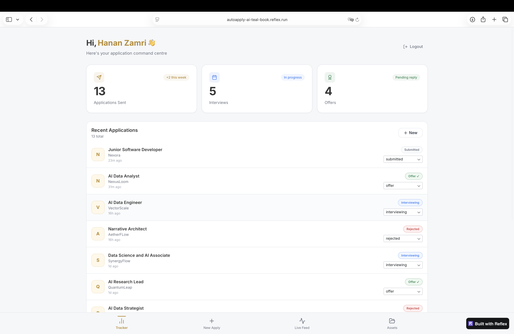
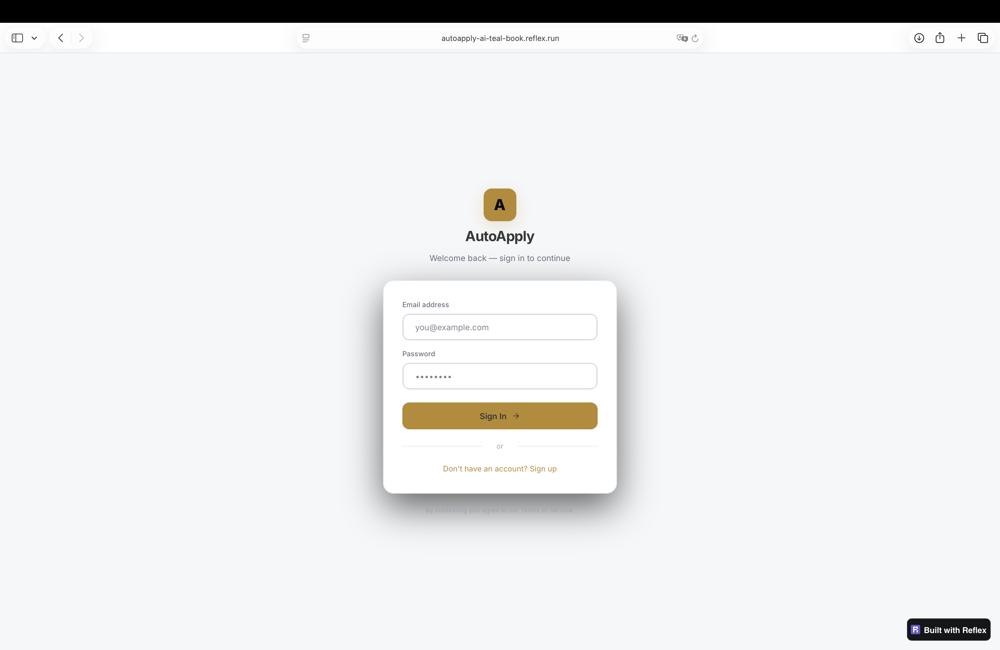
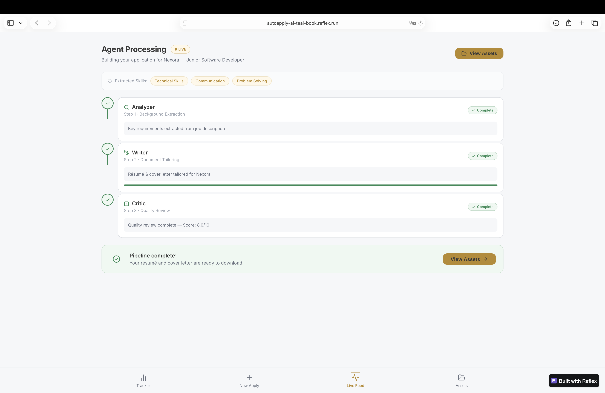
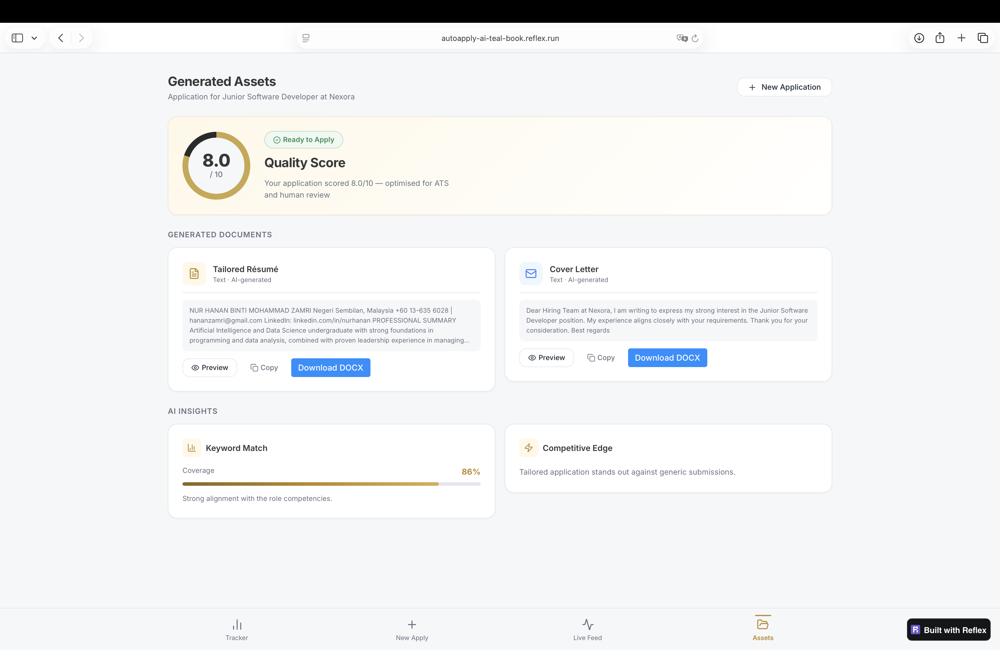

# AutoApply AI

AI-powered job application assistant that tailors resumes, generates cover letters, scores applications, and tracks your entire job search — all in one place.



---

## Demo

🔗 [https://autoapply-ai-teal-book.reflex.run](https://autoapply-ai-teal-book.reflex.run)
📹 

---

## Overview

AutoApply AI removes the manual work from job applications. Upload your resume, paste a job description, and a 3-agent AI pipeline will extract keywords, tailor your documents, and score your application against ATS standards — in seconds.

---

## Features

- **Resume Tailoring** — Upload PDF or DOCX, get a role-specific version with ATS keywords injected
- **Cover Letter Generation** — Personalised cover letters based on the company and job description
- **3-Agent AI Pipeline** — Analyzer → Writer → Critic pipeline with live progress feed
- **ATS Scoring** — Application scored out of 10 with keyword match percentage and competitive edge analysis
- **Application Tracker** — Track status across submitted, interviewing, offer, and rejected stages
- **Dashboard Analytics** — Total applications, interviews, and offers at a glance
- **Export** — Download tailored resume and cover letter as DOCX

---

## Screenshots

### login


### Dashboard


### New Application


### Live Pipeline Feed


### Application Tracker


---

## Tech Stack

| Layer | Technology |
|---|---|
| Frontend | Reflex, Python, Radix UI |
| Backend | Python, Reflex State |
| AI | OpenRouter API (Claude 3.5 Haiku) |
| Database | Supabase (PostgreSQL + Auth) |
| Documents | pypdf, python-docx, ReportLab |

---

## Project Structure

```
autoapply_ai/
├── pages/
│   ├── login.py
│   ├── tracker.py
│   ├── new_apply.py
│   ├── live_feed.py
│   ├── assets.py
│   └── profile.py
├── components/
│   ├── layout.py
│   └── bottom_nav.py
├── db/
│   ├── client.py
│   └── history.py
├── services/
│   ├── ai_service.py
│   └── export.py
├── state.py
├── styles.py
└── autoapply_ai.py
```

---

## Installation

```bash
git clone https://github.com/hananzamri/autoapply-ai.git
cd autoapply-ai
python -m venv venv
source venv/bin/activate
pip install -r requirements.txt
```

Create a `.env` file:

```env
SUPABASE_URL=https://your-project.supabase.co
SUPABASE_KEY=your-anon-key
OPENROUTER_API_KEY=your-openrouter-key
```

Run locally:

```bash
reflex run
```

Open [http://localhost:3000](http://localhost:3000)

---

## Roadmap

- [x] Resume tailoring
- [x] Cover letter generation
- [x] ATS keyword scoring
- [x] Application tracker
- [x] DOCX export

---

## Author

**Nur Hanan Mohammad Zamri**  
Artificial Intelligence & Data Science — Sejong University  
[linkedin.com/in/nurhanan](https://linkedin.com/in/nurhanan)

---

## License

MIT License
